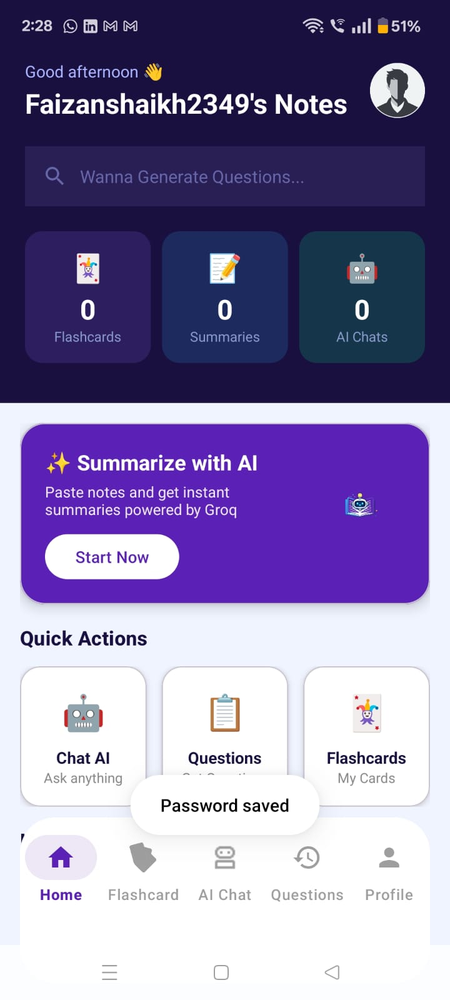
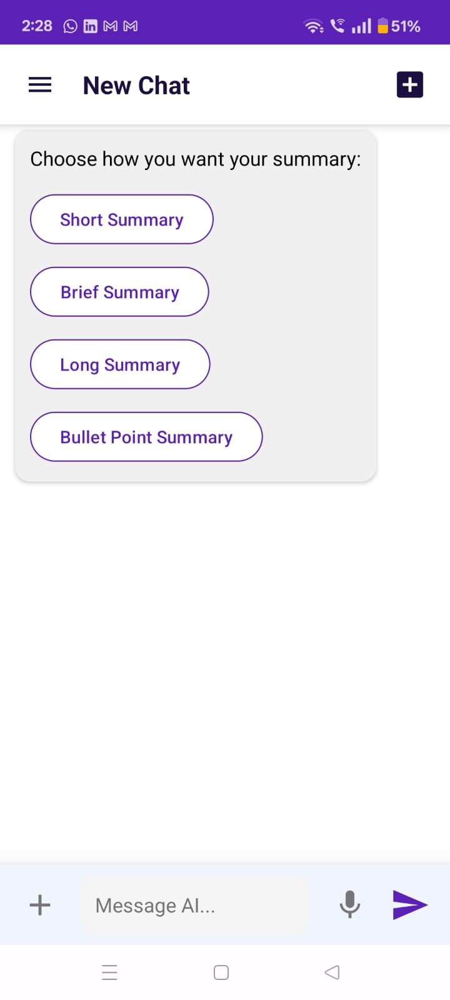
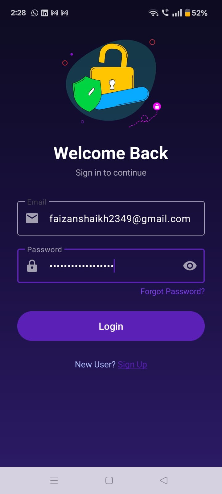
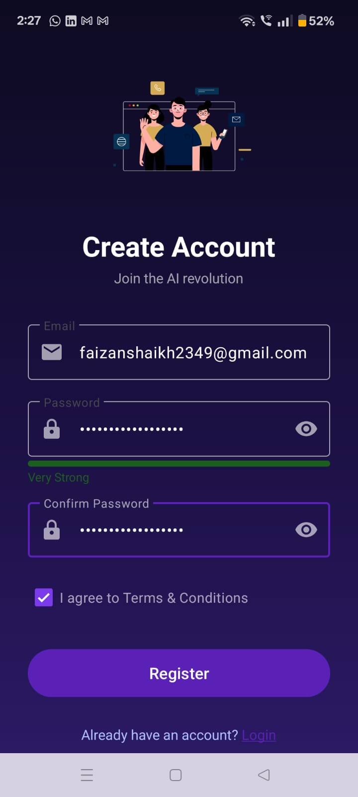
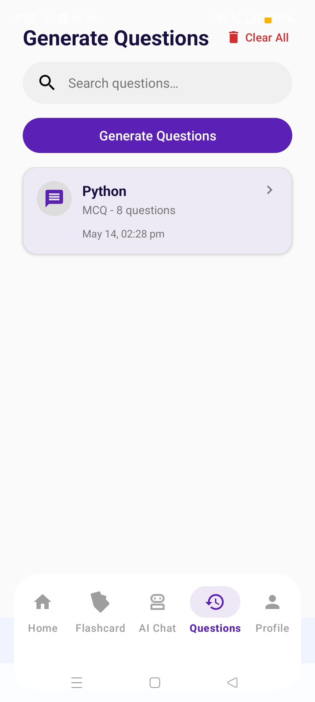

# AI Note Summarizer

AI-powered Android application that summarizes user notes using API integration.

## Features
- AI-powered text summarization
- Clean Android UI
- Fast response handling
- Simple and user-friendly design

## Technologies Used
- Java
- Android Studio
- Retrofit/API Integration
- Firebase (if used)

## Future Improvements
- Save summary history
- Export summaries
- Better UI/UX

## Author
Mohammed Faizan Mansuri

## Screenshots

### Home Screen
## Screenshots

### Home Screen

### AI Chats Screen

### Login Screen

### Registeration Screen

### Question Screen
